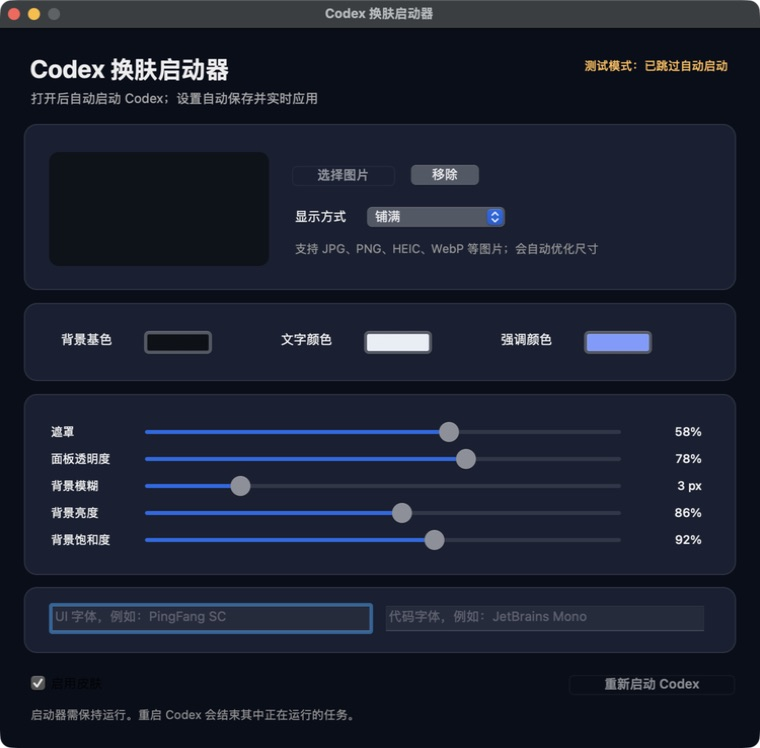

# Codex Skin Launcher / Codex 皮肤与布局启动器

[](https://github.com/Tangc/codex-skin-launcher/releases)
[](https://github.com/Tangc/codex-skin-launcher/releases)
[](https://github.com/Tangc/codex-skin-launcher/actions/workflows/windows-build.yml)
[](LICENSE)
[](https://github.com/Tangc/codex-skin-launcher/releases/latest)

一个面向 macOS 和 Windows 的 Codex 桌面皮肤与布局启动器。除了背景图片、透明面板和颜色/字体自定义，还能把 Codex 改造成微信式、飞书式或 QQ 2007 式工作台。双击后会自动启动 Codex 并应用上次保存的方案，不需要打开终端或手动粘贴 CSS/JavaScript。

> 这是社区项目，不是 OpenAI 官方产品。它依赖 Codex 桌面客户端的内部页面结构，Codex 更新后可能需要同步适配。



## 功能

- 自动启动或重启 Codex
- 四种工作台布局：原始、微信式、飞书式、QQ 2007 复古式
- 为 Codex 增加顶部工具栏、右侧任务信息栏和底部状态栏
- 顶部快捷入口会尝试调用 Codex 原有的新任务、文件、终端、变更、浏览器和设置功能
- 选择本地背景图，支持铺满或完整显示
- 调整背景色、文字色和强调色
- 调整遮罩、面板透明度、模糊、亮度和饱和度
- 设置 UI 字体和代码字体
- 配置自动保存，修改后实时生效
- 新窗口和页面刷新后自动重新注入
- 一键关闭皮肤并恢复 Codex 原始外观

## 安装

### Windows 11

1. 在 [Releases](https://github.com/Tangc/codex-skin-launcher/releases/latest) 下载 `CodexSkinLauncher-windows-x64.zip`。
2. 解压后双击 `CodexSkinLauncher-Windows.exe`。
3. 启动器会识别 Microsoft Store / MSIX 安装的 Codex，自动重启并应用皮肤。

Windows 构建是自包含单文件程序，不需要安装 Node.js、.NET SDK 或打开 PowerShell。当前没有代码签名，首次运行时 Windows Defender SmartScreen 可能显示来源提示。

要求：

- Windows 11 x64
- 已安装最新版 [OpenAI Codex Windows 客户端](https://learn.chatgpt.com/docs/windows/windows-app)

如果使用非标准安装包，可以在启动启动器前设置 `CODEX_APP_PATH`，指向实际的 `Codex.exe`。

### macOS

1. 在 [Releases](https://github.com/Tangc/codex-skin-launcher/releases/latest) 下载最新的 `CodexSkinLauncher-macos-arm64.zip`。
2. 解压后双击 `Codex换肤启动器.app`。
3. Codex 会自动重启，并应用上次保存的皮肤。

当前 Release 为 Apple Silicon 构建，使用临时签名，没有 Apple Developer ID 公证。如果 macOS 阻止运行，建议按下方说明从源码构建，不建议使用命令绕过系统安全检查。

### macOS 从源码构建

要求：

- macOS 13 或更高版本
- 已安装 Codex 桌面客户端（默认位于 `/Applications/ChatGPT.app`）
- Xcode Command Line Tools：`xcode-select --install`

```bash
git clone https://github.com/Tangc/codex-skin-launcher.git
cd codex-skin-launcher
./scripts/build.sh
open dist/Codex换肤启动器.app
```

构建脚本会针对当前 Mac 架构生成应用和 ZIP，产物位于 `dist/`。

### Windows 从源码构建

要求 Windows 11 和 .NET 8 SDK：

```powershell
git clone https://github.com/Tangc/codex-skin-launcher.git
cd codex-skin-launcher
.\scripts\build-windows.ps1
```

脚本会生成自包含 EXE 和 `dist\CodexSkinLauncher-windows-x64.zip`。每个 Pull Request 也会在 GitHub 的 Windows Runner 中自动编译，避免只在非 Windows 环境做静态检查。

## 使用说明

1. 打开启动器后，Codex 会自动启动或重启。
2. 选择工作台布局、背景图、颜色和字体，效果会实时应用。
3. 保持启动器运行，以便为新窗口和刷新后的页面继续注入皮肤。
4. 选择“原始布局”只移除工作台外壳；关闭“启用皮肤与布局”会同时恢复 Codex 原始外观。

启动器会自动重启已经打开的 Codex，因此会结束 Codex 中正在运行的任务。请先等待当前任务完成。

配置保存在：

```text
# macOS
~/Library/Application Support/Codex Skin Launcher/

# Windows
%LOCALAPPDATA%\Codex Skin Launcher\
```

## 工作原理

启动器会以仅限本机访问的调试端口启动 Codex：

```text
127.0.0.1:9333
```

随后通过 Chrome DevTools Protocol 为 Codex 页面创建独立样式表，并注入共享的布局主题引擎。引擎使用隔离的 Shadow DOM 生成工具栏和信息栏，不移动 Codex 自己管理的 React 节点；启动器会持续监控新窗口、页面刷新和配置变化。背景图会在本地压缩后转换为 Data URL，不会上传到网络。

三套工作台是对交互结构的重新编排，不是微信、飞书或 QQ 的官方皮肤，也不包含这些产品的商标或素材：

| 布局 | Codex 中的对应体验 |
| --- | --- |
| 微信式工作台 | 深色会话栏、聊天气泡、绿色状态提示、右侧任务资料 |
| 飞书式工作台 | 浅色顶部工具区、卡片化内容区、蓝色协作状态、右侧上下文 |
| QQ 2007 复古工作台 | 蓝色渐变工具栏、经典描边面板、助手资料卡、底部状态栏 |

窗口宽度小于约 1180 像素时，右侧信息栏会自动隐藏，把空间留给当前任务。快捷入口会根据可见文字和无障碍标签定位 Codex 原有按钮；客户端更新后若某个入口暂时失效，可以继续使用 Codex 原界面操作。

它不会修改 Codex 的 `app.asar`、应用签名或安装目录。Windows 版只读取 MSIX 的 `AppxManifest.xml` 来定位官方入口。退出启动器后，皮肤注入器会停止；但 Codex 的调试端口会保持到该 Codex 进程退出，因此不使用时请同时退出 Codex。

## 安全边界

- 调试端口只绑定 `127.0.0.1`，不要修改为局域网或公网地址；退出启动器后请同时退出 Codex，以关闭该端口。
- 启动器运行期间，本机其他进程理论上可以访问该调试端口；不要运行来源不明的软件。
- 背景图和配置只保存在本机。
- 项目不会上传或保存 Codex 对话内容。布局引擎只读取当前页面标题、路径以及可见按钮的文字/无障碍标签，用于显示任务名称和转发快捷操作。
- macOS 发布版没有 Apple Developer ID 公证，Windows 发布版当前没有代码签名；可审阅源码并自行构建。

更多信息见 [SECURITY.md](SECURITY.md)。

## 开发验证

```bash
./scripts/test-layout-themes.sh
./scripts/build.sh
```

布局测试会在本机 Chrome 的临时用户目录中依次验证原始、微信式、飞书式和 QQ 2007 式布局，结束后主动关闭测试进程。Windows 版可使用 `dotnet build windows/CodexSkinLauncher.Windows.csproj --configuration Release` 编译验证。

## 兼容性

- macOS：已在 Apple Silicon 和 Codex `26.715.21316` 上验证。
- Windows：目标为 Windows 11 x64 和 Microsoft Store / MSIX 版 `OpenAI.Codex`；由 GitHub `windows-latest` Runner 编译验证。
- Codex 内部 CSS Token、无障碍标签或窗口结构变化时，可能需要更新注入样式和快捷入口映射。

## 卸载

删除 `Codex换肤启动器.app`，并按需删除：

```text
~/Library/Application Support/Codex Skin Launcher/
```

Windows 删除 `CodexSkinLauncher-Windows.exe`，并按需删除：

```text
%LOCALAPPDATA%\Codex Skin Launcher\
```

## 开源协议

[MIT](LICENSE)
